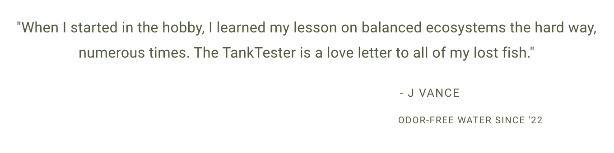

# Tankio

On average, most aquarium keepers perform a 20%-25% water change weekly out of necessity. When the water has an odor, and gunk prevails, the keeper dreads the next encounter. Our goal is to educate past, current, and future freshwater aquatic hobbyists on the benefits of maintaining planted aquariums, ensuring a harmonious and thriving environment for aquatic inhabitants.

## Getting Started

Once you have the repo forked and cloned down to your local machine, open your terminal and confirm that you are in the parent directory of the repo, then.

    cd server

    pipenv install

    pipenv shell

This command wil install all server side dependencies that are needed for the project and start the virtual enviornment for your application.

Confirm you are still within your server folder, if you are not, cd into it and run the following.

    flask db init

    flask db migrate -m 'initial'

    flask db upgrade head

    python seed.py
    
    python app.py

The above commands will initialize the database, seed it, along with start the backend database to be used.

Next, we need to get the client side of things up and running. Open a new terminal and enter the following. 

    cd client

    npm install

If you have completed the server side commands and have the server side up and running in another terminal, you are ready to start the app! In the same client terminal, run the following!

    npm start
